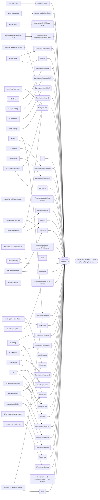

# FULL-PICTURE — categories → TESSERA modules

Source graph: `full-picture-memory.jsonl` (memory-MCP format). Rule: Tessera loads the whole graph before any v3/v4 self-upgrade.

```mermaid
flowchart LR
  n0["consciousness-cognitive-arch"] --> n1("Cognition core (Foreman/Tessera Lead)")
  n2["agi-frameworks"] --> n3("Foreman")
  n2["agi-frameworks"] --> n4("worker sandboxes")
  n5["memory-recall"] --> n6("Knowledge graph MCP memory")
  n7["brain-scans-connectomics"] --> n8("Knowledge graph (research data only)")
  n9["brain-synapse-simulation"] --> n10("Compute lab")
  n11["reasoning-thinking"] --> n12("Foreman reasoning")
  n11["reasoning-thinking"] --> n13("token lab")
  n14["agent-skills"] --> n15("Agents studio (skills per desk)")
  n16["llms-open-inference"] --> n10("Compute lab")
  n16["llms-open-inference"] --> n17("api-server")
  n18["machine-learning"] --> n10("Compute lab")
  n19["token-saving-compression"] --> n20("Token lab")
  n21["anti-hallucination-grounding"] --> n22("Security/shepherd")
  n21["anti-hallucination-grounding"] --> n23("evals")
  n24["recursive-self-improvement"] --> n25("Foreman upgrade loop (v3/v4)")
  n26["multi-agent-orchestration"] --> n3("Foreman")
  n26["multi-agent-orchestration"] --> n27("TaskGraph")
  n28["knowledge-graphs"] --> n6("Knowledge graph MCP memory")
  n29["evals"] --> n22("Security/shepherd")
  n29["evals"] --> n30("CI")
  n31["sandboxed-code-exec"] --> n32("Worker sandboxes")
  n33["local-offline-inference"] --> n34("Offline mesh O1-O11")
  n33["local-offline-inference"] --> n35("compute lab")
  n36["rag"] --> n37("Knowledge graph")
  n36["rag"] --> n38("adapters")
  n39["world-simulation"] --> n40("Agents studio (3D floor)")
  n41["continual-learning"] --> n10("Compute lab")
  n41["continual-learning"] --> n42("memory")
  n43["tool-use-mcp"] --> n44("Adapters (MCP)")
  n45["k-affective-computing"] --> n46("Curriculum")
  n45["k-affective-computing"] --> n47("empathy module")
  n48["k-human-behavior"] --> n46("Curriculum")
  n48["k-human-behavior"] --> n49("perception")
  n50["k-neurology"] --> n51("Curriculum (neuro)")
  n52["k-physiology"] --> n53("Curriculum (physiology)")
  n54["k-medicine"] --> n55("Curriculum (medicine)")
  n56["k-sciences"] --> n57("Curriculum (sciences)")
  n58["k-coding"] --> n59("Curriculum (coding)")
  n58["k-coding"] --> n13("token lab")
  n60["k-hardware"] --> n61("Curriculum (hardware)")
  n60["k-hardware"] --> n62("mesh nodes")
  n63["k-engineering"] --> n64("Curriculum (engineering)")
  n65["k-quantum"] --> n66("Curriculum (quantum)")
  n65["k-quantum"] --> n35("compute lab")
  n67["k-geometry"] --> n68("Curriculum (geometry)")
  n67["k-geometry"] --> n69("3D floor")
  n70["k-biology"] --> n71("Curriculum (biology)")
  n72("Shepherd relay") --> n73
  n69 --> T[(TESSERA v2)]
  n44 --> T[(TESSERA v2)]
  n40 --> T[(TESSERA v2)]
  n15 --> T[(TESSERA v2)]
  n30 --> T[(TESSERA v2)]
  n1 --> T[(TESSERA v2)]
  n10 --> T[(TESSERA v2)]
  n46 --> T[(TESSERA v2)]
  n71 --> T[(TESSERA v2)]
  n59 --> T[(TESSERA v2)]
  n64 --> T[(TESSERA v2)]
  n68 --> T[(TESSERA v2)]
  n61 --> T[(TESSERA v2)]
  n55 --> T[(TESSERA v2)]
  n51 --> T[(TESSERA v2)]
  n53 --> T[(TESSERA v2)]
  n66 --> T[(TESSERA v2)]
  n57 --> T[(TESSERA v2)]
  n73 --> T[(TESSERA v2)]
  n3 --> T[(TESSERA v2)]
  n12 --> T[(TESSERA v2)]
  n25 --> T[(TESSERA v2)]
  n37 --> T[(TESSERA v2)]
  n8 --> T[(TESSERA v2)]
  n6 --> T[(TESSERA v2)]
  n34 --> T[(TESSERA v2)]
  n22 --> T[(TESSERA v2)]
  n72 --> T[(TESSERA v2)]
  n27 --> T[(TESSERA v2)]
  n20 --> T[(TESSERA v2)]
  n32 --> T[(TESSERA v2)]
  n38 --> T[(TESSERA v2)]
  n17 --> T[(TESSERA v2)]
  n35 --> T[(TESSERA v2)]
  n47 --> T[(TESSERA v2)]
  n23 --> T[(TESSERA v2)]
  n42 --> T[(TESSERA v2)]
  n62 --> T[(TESSERA v2)]
  n49 --> T[(TESSERA v2)]
  n13 --> T[(TESSERA v2)]
  n4 --> T[(TESSERA v2)]
  V2[v2-memory + V2-FEATURE-MAP + REA shards] --> T
  T --> U{{v3 / v4 self-upgrade — only after full-graph review}}
```
